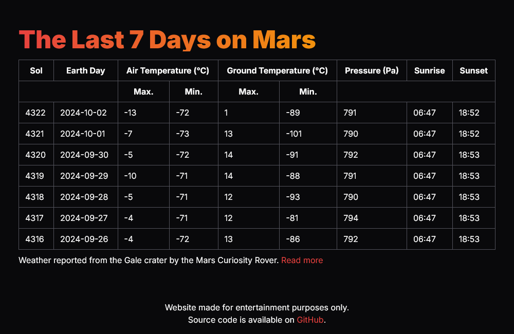

<!--suppress HtmlDeprecatedAttribute -->

## About

*Mars Weather* is a single-page application developed in React. It uses the publicly available NASA Mars Science
Laboratory (MSL) API to retrieve weather readings reported by the Curiosity rover. You can read more about MSL and
Curiosity rover on [NASA.gov](https://mars.nasa.gov/msl/home/).

## Attributions

### Data

[Data is obtained from NASA MSL.](https://science.nasa.gov/mission/msl-curiosity/)

### Logo

[Mars SVG Vector designed by Good Stuff No Nonsense and obtained from SVG Repo.](https://www.svgrepo.com/svg/440497/mars)

## License

[MIT](LICENSE)